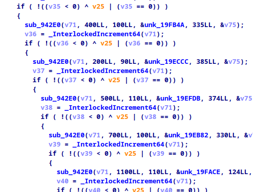
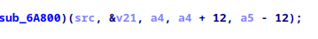
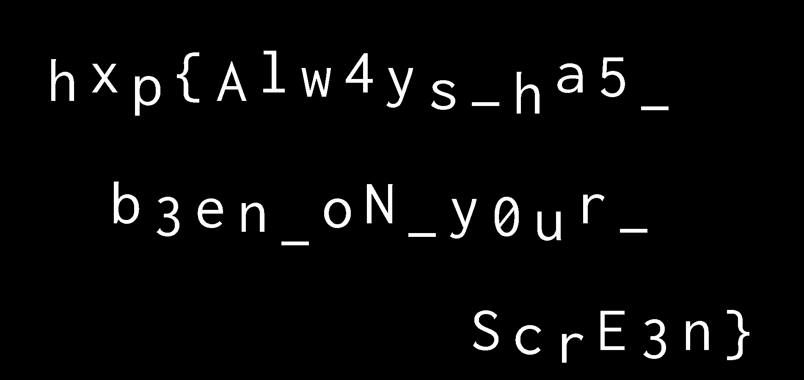

# harlem_shake

This was a reversing CTF challenge for [hxp 38C3 CTF](https://2024.ctf.link/) I created.

Challenge: <https://2024.ctf.link/internal/challenge/168a3050-bd0b-4053-930a-366d0fe82294/>

## Writeup

We'll go directly into the main method and see some setup until we arrive at a long list of function calls to `sub_942E0` with changing parameters.

Analyzing `sub_942E0`, we first see a hardcoded key `91b16ca0da5d332cb9909596be5f6918f0e11956f55685f111d105c4a5ec5f58` as well as a string `Stop patching pls :(`. This is triggered if we patch the given blobs of data passed to the function or the key itself so the decryption fails.

Starting the program changes the position and size of all X11 windows. I'm running on Sway, so that doesn't affect me, but we can also skip that call in the debugger.

We then set a breakpoint in `sub_942E0` and let the program decrypt the image for us. The first image a `{` character.

Well, this seems tedious, why don't we just decrypt the images ourselves?

We know all offsets as seen in the screenshot above. We also know the key, and the constant `expand 32-byte k` gives us a hint we might be using using Salsa20/ChaCha20.

We see that the decrypt function is called with a 12 byte offset.

12 bytes nonce length are default for ChaCha20, so let's just try ChaCha20-Poly1305[1] and it works out of the box. The first image decodes correctly.

Now we automate it for all character-images and place them to the wanted positions (which are also passed into `sub_942E0`).

We also found this string in the binary: `Screen too small :(, min size 1900 x 900`. These values we use to create our image.

Solve Script:
[decrypt.py](decrypt.py)

`hxp{Alw4ys_ha5_b3en_oN_y0ur_ScrE3n}`

Alternative solution and what is actually going on:

What the program actually does is putting all character images together into one big image and then sending this image to the XServer creating a clickable region.

Meaning: You can click through everything except the characters itself. You might have seen this when hovering over certain areas that "randomly" your mouse changes when `harlem_shake` is running.

Using tools like XScope, or adding logging in XServer, you can just read out the requests and get the flag.

[1]: https://pycryptodome.readthedocs.io/en/latest/src/cipher/chacha20_poly1305.html
